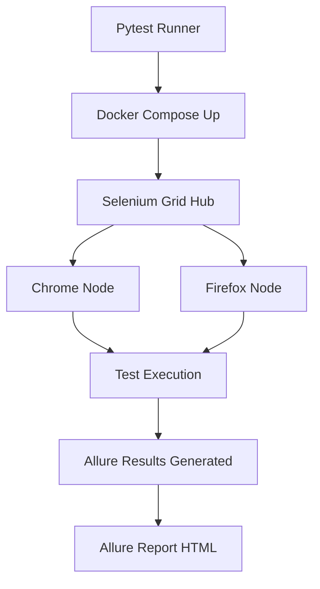

# 🚀 Selenium Pytest UI Automation Framework


---

## 📖 Overview

This is a **Selenium UI Automation Framework** using Python and Pytest. It supports:

✅ Page Object Model (POM) for clean, maintainable code
✅ Dockerized Selenium Grid for cross-browser testing
✅ Parallel & marker-based test execution in GitHub Actions CI/CD
✅ Rich Allure Reports with screenshots and logs
✅ Easy scalability for real-world test suites

---

## 🏗 Framework Highlights

| Feature                     | Details                                                                |
| --------------------------- | ---------------------------------------------------------------------- |
| **Page Object Model (POM)** | Encapsulated locators & actions in `pages/` for reusability            |
| **Fixtures & Scopes**       | Session & function scoped fixtures for setup/teardown in `conftest.py` |
| **Explicit Waits**          | `utils/wait_utils.py` handles dynamic elements reliably                |
| **Markers**                 | `@pytest.mark.smoke`, `@pytest.mark.regression`, `@pytest.mark.flow`   |
| **Parallel Execution**      | `pytest-xdist` enabled multi-core runs                                 |
| **Pytest Hooks**            | Screenshots on test pass/fail, Allure step logging                     |
| **Allure Reporting**        | Full HTML reports with screenshots and metadata                        |
| **Docker Integration**      | Selenium Grid (Hub + Chrome/Firefox nodes) via Docker Compose          |
| **CI/CD Workflows**         | Sequential & Parallel runs in GitHub Actions with caching & artifacts  |

---

## 🧪 Core Scenarios Covered

* ✅ **Basic Search Verification**: Home → Search → Validate title & links
* ✅ **Edge Cases**: Blank searches, special characters, long inputs
* ✅ **Flow Tests**: Multi-step workflows across pages
* ✅ **Negative Tests**: Intentional failures to verify error handling & screenshots

---

## 📂 Folder Structure

```bash
selenium-pytest-ui-framework/
│
├── config/                # Test configs (e.g., implicit_wait, browser settings)
├── locators/              # Page locators
├── pages/                 # POM classes (SearchPage, ResultPage)
├── tests/                 # Organized tests (smoke, regression, flow)
├── utils/                 # Helper utilities (waits, file ops, constants)
├── reports/               # Allure results and HTML reports
├── .github/workflows/     # CI/CD pipelines (sequential & parallel)
├── Dockerfile
├── docker-compose.yml
├── wait-for-grid.sh
├── requirements.txt
└── README.md
```

---

## 🖼️ Test Flow Diagram



---

## 🐳 Docker & CI/CD Highlights

### 🚀 Docker Compose

* Hub + Chrome/Firefox nodes defined in `docker-compose.yml`
* Healthcheck logic with retries via `wait-for-grid.sh`

### 📦 GitHub Actions Workflows

* **docker-selenium-grid.yml** → Sequential Docker Grid runs
* **pytest-markers-parallel.yml** → Parallel marker-based runs
* Allure reports & screenshots uploaded as artifacts
* Docker layer caching for faster builds

---

## 🛠 Setup Instructions

### 🖥 Run Locally

```bash
# Create virtualenv & install dependencies
pip install -r requirements.txt

# Run tests
pytest -m smoke

# View Allure Report
allure serve reports/allure-results
```

### 🐳 Run with Docker

```bash
# Start Selenium Grid
docker-compose up -d

# Run tests inside Docker
pytest --browser Chrome

# Stop Grid
docker-compose down
```

### 🌐 Run in CI/CD

Push to `main` branch to trigger workflows:

* Sequential: docker-selenium-grid.yml
* Parallel: pytest-markers-parallel.yml

---

## 🪝 Debugging Notes & Fixes

| Issue                          | Fix                                                     |
| ------------------------------ | ------------------------------------------------------- |
| `allure: not recognized`       | Used `allure.bat` or added Allure bin to PATH           |
| Selenium Grid healthcheck fail | Added `wait-for-grid.sh` retry logic                    |
| GitHub Runner OOM (7GB limit)  | Reduced Hub/node memory, limited parallel workers       |
| Large Allure artifacts         | Synced reports via Docker volume mapping                |
| Flaky tests on Grid            | Added explicit waits and retry logic in `wait_utils.py` |

---

## 📸 Allure Report (GIF)


---

## 📋 What I Learned

* Advanced Pytest (markers, fixtures, hooks, parallel runs)
* Dockerized Selenium Grid with healthcheck
* Debugging CI/CD memory issues on GitHub runners
* Allure Reporting integration
* Artifact management and caching in workflows

---

## 🌟 Future Improvements

* Integrate Jenkins pipeline
* Add Playwright for API testing
* Cloud Grid (BrowserStack/SauceLabs)

---

## 👩‍💻 Quick Recap for Interviews

* Framework: POM, fixtures, explicit waits, hooks, markers
* Docker: Hub + Chrome/Firefox, healthcheck
* CI/CD: Sequential & parallel workflows, artifacts, caching
* Debugging: Solved Grid issues, memory limits, flaky tests

---

## 🏷 Badges


(Replace `<username>` and `<repo>` with your GitHub details)

---

